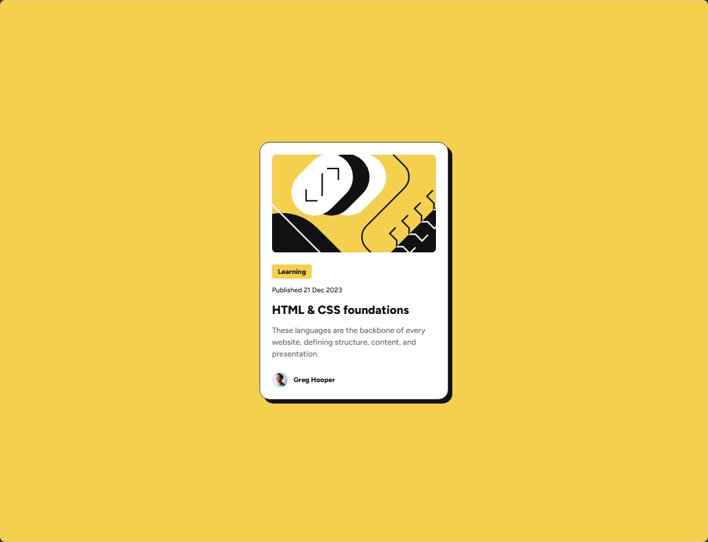

# Frontend Mentor - Blog preview card solution

This is a solution to the [Blog preview card challenge on Frontend Mentor](https://www.frontendmentor.io/challenges/blog-preview-card-ckPaj01IcS). Frontend Mentor challenges help you improve your coding skills by building realistic projects.

## Table of contents

- [Overview](#overview)
  - [The challenge](#the-challenge)
  - [Screenshot](#screenshot)
  - [Links](#links)
- [My process](#my-process)
  - [Built with](#built-with)
  - [What I learned](#what-i-learned)
  - [Continued development](#continued-development)
  - [Useful resources](#useful-resources)
  - [AI Collaboration](#ai-collaboration)
- [Author](#author)

## Overview

### The challenge

Users should be able to:

- See hover and focus states for all interactive elements on the page

### Screenshot

### Links

- Solution URL: [Add solution URL here](https://your-solution-url.com)
- Live Site URL: [Add live site URL here](https://your-live-site-url.com)

## My process

### Built with

- Semantic HTML5 markup
- CSS custom properties
- Flexbox
- BEM naming methodology
- Mobile-first workflow
- Responsive design

### What I learned

In this project, I mainly learned how to use semantic HTML elements to create a more meaningful page structure and how to follow the BEM methodology for organizing and naming CSS classes.

I also improved my understanding of CSS custom properties, viewport units such as `vh` and `dvh`, and how to reduce unnecessary code repetition by identifying shared and reusable styles.

### Continued development

I’ll continue working on writing more inclusive and accessible code.

### Useful resources

- [MDN Web Docs](https://developer.mozilla.org/) - A great reference for understanding semantic HTML, CSS properties, and web accessibility. It helped me better understand some of the concepts I applied throughout this project.

### AI Collaboration

I used ChatGPT as a learning and code review assistant throughout this project. Rather than generating the solution, I used it to review my HTML and CSS, clarify concepts, and discuss possible improvements.

It helped me deepen my understanding of semantic HTML, BEM naming conventions, responsive CSS, accessibility, and best practices while keeping the focus on understanding the reasoning behind my code.

## Author

- Frontend Mentor - [@DiogoLuxa](https://www.frontendmentor.io/profile/DiogoLuxa)
